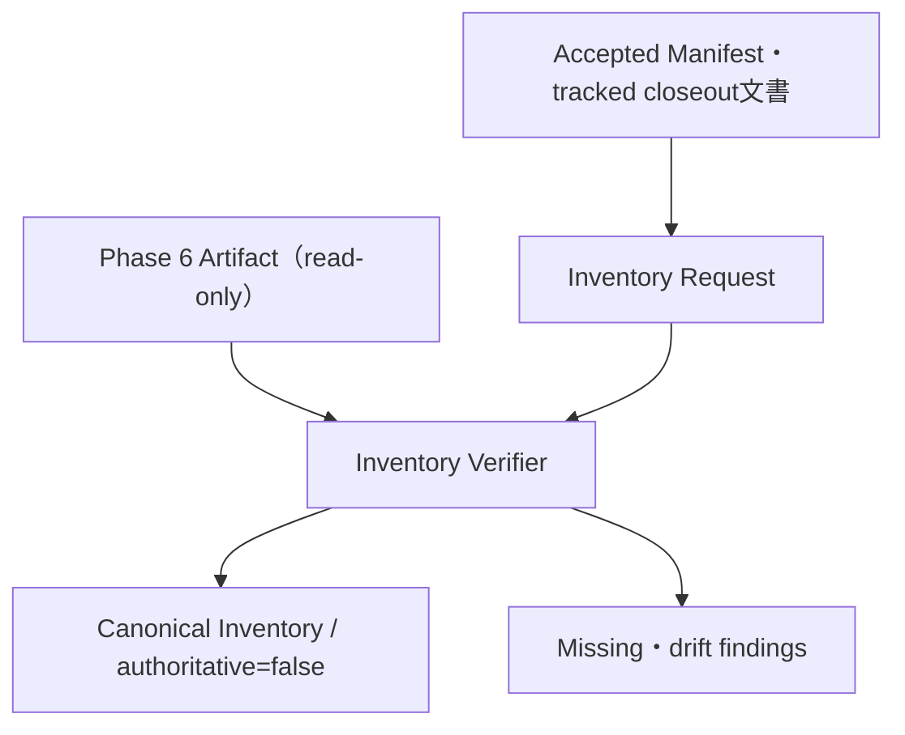

# Phase 7A: Evidence Inventory & Retention Policy — 実装計画書

**Status:** Slice 7A-1〜7A-4実装済み（real ArtifactのInventory生成とPhase status変更は未実施）
**対象branch:** `feature/phase7`
**対象scope:** Phase 6の保存Artifactだけ
**設計原則:** Catalogは新しいstatus正本ではなく、既存正本と保存Artifactの一致を検証して表示する、非権威的な派生成果物である。

## 1. 目的と完了像

Phase 7Aの目的は、Phase 6のreleaseとCampaignを一箇所から発見し、評価分母への混入、Artifactの欠落・改変、及び保持状態を、既存Artifactを一切変更せずに検出・表示できるようにすることである。

完了時には、レビュー済みの`EvidenceInventoryRequest 1.0`から次の3ファイルをcreate-onlyで生成できる。

- `evidence-inventory.json`: 機械可読、canonical JSONのInventory本体
- `evidence-inventory.md`: 同じ内容を要約した決定的な人間向け表示
- `evidence-inventory.metadata.json`: 生成時刻など非決定的metadataのsidecar

Artifactに欠落・drift・classification不整合があっても、入力Request自体と安全な読取境界が健全なら、`verification_status=failed`とfindingを含むInventoryを生成する。これは既存のaccepted status、current release、Human Acceptance、Phase statusを変えない。

## 2. Authority境界（最初に固定するDecision）

現行の正本は置換しない。Inventory Requestと出力Catalogには、必ず`authoritative: false`をliteralで持たせる。

| 事実 | 現在の正本 | Phase 7Aが行うこと | Phase 7Aが行わないこと |
| --- | --- | --- | --- |
| 言語status | 人間がacceptedしたPublic Suite Manifest | Manifestをstrictに検証し、Requestの期待値と照合する | statusを導出・変更する |
| Phase status / supersession | tracked closeout文書（`docs/ROADMAP.md`とPhase 6 closeout） | hash束縛した参照として表示する | filesystem順、日時、HEADからcurrentを選択する |
| 実行結果 | Campaign / Recording / Evidence | 完全性、binding、call accountingを検証する | Campaignを再実行・修復する |
| 公開結果 | bundle / `checksums.json` / External Anchor | bundle treeとrenderer結果を照合する | bundleを再生成・公開し直す |



次の規則をAcceptanceまで維持する。

- `accepted_current`／`accepted_superseded`は、人間レビュー済み正本からRequestへ**転記した宣言**である。Verifierは根拠文書bytesとManifestを検証するが、文書の自然言語を解釈してcurrentを自動決定しない。
- `declaration_basis`はstatusをgrantしない。根拠の文書・Manifestが指定したbytes／SHA-256と一致することだけを検証する。
- 発見された新しいdirectory、未知のArtifact名、timestamp、Git branch、filesystem順からclassificationを推測しない。Requestに明示列挙されていないものは、許可されたtree内で`unexpected_path` findingにできるだけである。
- `verification_status=verified`はInventoryの入力検証が成功したことだけを意味する。Phase 6の再Acceptance、外部backupの現在可用性、Live Providerの能力を意味しない。

## 3. Scope、Non-goals、前提条件

### In scope

- Phase 6のRelease classification: `accepted_current`、`accepted_superseded`、`historical`、`candidate_unaccepted`、`abandoned_preparation`
- Phase 6のCampaign classification: `primary_evaluation`、`audit_only_failure`、`abandoned_inconclusive`、`historical_non_primary`
- 既存のPhase 6 strict loader、cross-artifact validator、Public Suite rendererを使ったread-only検証
- storage / integrity / retentionの独立した状態表示
- 観測済みProvider-call accountingの集計・表示。ただし評価分母とは分離する。

### Non-goals

- Phase 3、4、5又は将来PhaseのCatalog化
- Provider、Prompt、Gate、Campaign、Report、Public Suiteの実行または再生成
- network、外部backupの作成、Artifactの移動・削除・修復・rename
- current release、status、supersession、Human Acceptanceの自動選択・更新・grant
- Live実行、API key／`CODEX_HOME`／認証情報の読取・保存
- dashboard、leaderboard、統計的検定、Usage又はコストの再解釈
- 保持期限の自動適用又は削除機能

### 実装開始前の確認事項

1. 人間がPhase 7A用のProblem Statement、脅威model、maintainerを承認する。
2. Requestに列挙する実Artifactのpath、bytes、SHA-256、classification、根拠文書を人間が転記・レビューする。実ArtifactのInventory生成はSlice 7A-5の別Approvalとする。
3. Release／Campaignのprofileを明示し、Artifact名から意味を推測しない。
4. `feature/phase7`上の実装commitをレビューしてから、実Artifactに対するread-only実行を判断する。

## 4. データ契約

新規moduleは`ContractModel`の`extra="forbid"`、strict scalar型、重複JSON key拒否、非有限数拒否、canonical JSONを既存契約と同様に適用する。schema versionは`"1.0"`で開始し、未知fieldを黙って無視しない。

### 4.1 共通Enum

| Enum | 値・制約 |
| --- | --- |
| `InventoryScope` | literal `phase6` |
| `ReleaseClassification` | 上記5値。Campaign classificationとは別Enumにする。 |
| `CampaignClassification` | 上記4値。 |
| `StorageState` | `present` / `partial` / `missing` |
| `IntegrityState` | `verified` / `drifted` / `not_verifiable` |
| `RetentionState` | `local_only` / `external_copy_receipt_verified` / `unknown` |
| `RetentionVerificationBasis` | `local_artifact_only` / `receipt_only` / `not_available` |
| `RemoteLiveness` | literal `not_checked`（Phase 7Aはremoteへ接続しない） |
| `VerificationStatus` | `verified` / `failed` |
| `FindingCode` | 次節の表に列挙する閉じたEnum。全codeはexit `2`用の観測可能な検証findingである。 |

パスはすべてrepository-relative canonical POSIX pathとする。空文字、absolute path、Windows drive／separator、`..`、NUL、非canonical表現を拒否する。Request、入力Artifact、出力の相互aliasも拒否する。

### 4.1.1 FindingCodeの閉じた集合

Slice 7A-1で次の集合を固定し、実装はこの外のfinding codeを出力しない。各conditionは安全なsnapshotが確立できた場合だけ観測する。root／親pathの危険性、読取race、identity未確定はfindingではなくexit `1`の構築失敗である。

| FindingCode | 固定condition | Exit |
| --- | --- | --- |
| `authority_reference_missing` | 明示された根拠fileが存在しない | `2` |
| `authority_reference_bytes_mismatch` | 根拠fileのbyte countが期待値と異なる | `2` |
| `authority_reference_sha256_mismatch` | 根拠fileのSHA-256が期待値と異なる | `2` |
| `artifact_missing` | 明示されたArtifactが存在しない | `2` |
| `artifact_bytes_mismatch` | Artifactのbyte countが期待値と異なる | `2` |
| `artifact_sha256_mismatch` | ArtifactのSHA-256が期待値と異なる | `2` |
| `unsafe_artifact` | final pathのsymlink、hardlink、special fileをfollowせず確定できた | `2` |
| `unexpected_path` | 明示profileが許すtreeに未宣言pathが存在する | `2` |
| `canonical_load_failed` | expected canonical JSON／JSONL contractをstrict loadできない | `2` |
| `cross_artifact_mismatch` | Phase 6のSpec／Plan／Campaign／Recording／Evidence bindingが不一致 | `2` |
| `bundle_renderer_mismatch` | in-memory rendererのbytesと保存bundleが不一致 | `2` |
| `checksum_contract_mismatch` | `checksums.json`又はそのcoverageが不一致 | `2` |
| `external_anchor_mismatch` | External Anchorがchecksum contractと不一致 | `2` |
| `artifact_reviewed_commit_mismatch` | entryの`artifact_reviewed_commit`が既存Artifactのreviewed commitと不一致 | `2` |
| `artifact_reviewed_commit_not_verifiable` | profileが内部commitを要求しない又はArtifactに内部commitがなく、Request／declaration basis以外から照合できない | `2` |
| `classification_mismatch` | entry classification又はprofileが明示Artifact topologyと矛盾 | `2` |
| `denominator_mismatch` | primary denominator又はcomplete pairがaccepted Manifest由来の値と不一致 | `2` |
| `execution_repository_head_mismatch` | optional expected execution repository HEADと観測したcheckout HEADが不一致 | `2` |
| `retention_receipt_missing` | receipt検証を要求したがreceiptが存在しない | `2` |
| `retention_receipt_bytes_mismatch` | receiptのbyte countが期待値と異なる | `2` |
| `retention_receipt_sha256_mismatch` | receiptのSHA-256が期待値と異なる | `2` |
| `retention_receipt_invalid` | receiptがcanonical contract又はsubject全体digest bindingを満たさない | `2` |

findingの`detail`はcodeごとの固定templateから生成する。許可する差し込み値は閉じたsubject ID、role、repository-relative path、期待／観測のbyte count又はSHA-256だけとする。OS例外文字列、absolute path、Artifact本文、raw command outputをそのまま保存しない。

### 4.2 `EvidenceInventoryRequest 1.0`

Requestは次のtop-level fieldを持つ。

- `schema_version: "1.0"`
- `inventory_id`: stable lowercase identifier
- `authoritative: false`
- `scope: phase6`
- `expected_execution_repository_head`: optional 40/64-hex repository checkout HEAD
- `source_of_truth_references`
- `release_entries`
- `campaign_entries`
- `retention_expectations`

`AuthorityReference`は`reference_id`、`kind`（`accepted_manifest` / `tracked_closeout` / `human_acceptance_record`）、`path`、`byte_count`、`sha256`、固定短文の`description`を持つ。

`tracked_closeout`と`human_acceptance_record`は文書をstatus parserへ変換するものではない。Verifierはfile identity、bytes、SHA-256を検証し、Inventoryに根拠として表示する。classificationの意味は人間レビュー済みRequestにだけ由来する。

`expected_execution_repository_head`は、Inventory commandを起動したrepository rootのcheckout HEADに対する任意の期待値である。省略を許可し、指定時だけ観測値と照合する。これは実行中の`agentlab`バイナリ又はPython moduleが当該commit由来であることを証明せず、Phase 6 Artifactのprovenance検証には絶対に使用しない。

### 4.3 明示的なArtifact topology

各entryは単一の曖昧なrootではなく、fileとdirectory treeを別modelで明示する。roleはRelease用とCampaign用に別の閉じたEnumにし、Artifact名からkindを推測しない。

- `ExpectedFileArtifact`: single-link regular fileだけを対象にし、`role`、`path`、`byte_count`、`sha256`、`required`を持つ。
- `ExpectedTree`: real directoryだけを対象にし、`role`、`root_path`、許可されたdirectory集合、完全列挙した許可file集合（相対path、bytes、SHA-256）、`expected_file_count`、domain-separated `tree_sha256`、`required`を持つ。tree内のsymlink、hardlink、special file、unexpected pathは許可しない。
- `bundle_root`は`ExpectedTree`だけに許可する。`suite_manifest`、`checksums`、`external_anchor`及びCampaignのSpec／Plan／Campaign／Recording／Evidence等は`ExpectedFileArtifact`だけに許可する。

Release file roleの例は`suite_manifest`、`checksums`、`external_anchor`、Release tree roleは`bundle_root`、Campaign file roleの例は`spec`、`plan`、`campaign`、`recording`、`evidence`、`report_json`、`report_markdown`、`historical_verification`とする。role、kind、classificationの対応はmodel validatorで検証する。

`ReleaseEntry`は少なくとも`release_id`、`artifact_reviewed_commit`、`commit_verification_mode`、`classification`、`verification_profile`、`declaration_basis`、`file_artifacts`、`trees`、`superseded_by`を持つ。

- `accepted_current`はscope内にちょうど1件だけ許可する。複数候補から選ぶ機能ではない。
- `accepted_superseded`は`superseded_by`を明示し、cycleを禁止する。
- accepted releaseは`accepted_manifest`の根拠と`phase6_public_suite` profileを必須にする。
- `artifact_reviewed_commit`はPhase 6 Artifactに束縛されたcommitであり、Public Suite Manifest内の既存`reviewed_commit`とそのbound sourceから再導出して照合する。Phase 7のobserved execution repository checkout HEADとは比較しない。
- `historical`、`candidate_unaccepted`、`abandoned_preparation`でもprofileと期待Artifactを明示し、空の存在主張を許さない。

`CampaignEntry`は少なくとも`campaign_id`、`artifact_reviewed_commit`、`commit_verification_mode`、`classification`、`included_in_primary_denominator`、`release_id`、`verification_profile`、`declaration_basis`、`file_artifacts`、`trees`を持つ。

- `primary_evaluation`だけが`included_in_primary_denominator=true`である。
- `audit_only_failure`、`abandoned_inconclusive`、`historical_non_primary`は必ず`false`である。
- `campaign_id`、Artifact path、roleの組はRequest内で重複させない。
- `artifact_reviewed_commit`は、CampaignとManifest／Planが保存している既存reviewed commitとの一致をentry単位で確認する。
- `primary_evaluation`はaccepted releaseを参照し、同releaseのPublic Suite Manifestが列挙するprimary sourceのCampaign／Language／run集合と一致しなければならない。
- primary以外をManifestのprimary sourceへ紐づけること、又は同じCampaignを複数classificationで登録することを拒否する。

`CommitVerificationMode`は`internal_required`、`internal_if_present`、`declaration_basis_only`の閉じたEnumにする。`artifact_reviewed_commit`はRequestとdeclaration basisが期待するPhase 6 commitとして保持する。

- accepted／complete profileは`internal_required`だけを許可し、Public Suite Manifest、Plan、Campaign等の内部commitとの一致を必須にする。不在又は不一致は`artifact_reviewed_commit_mismatch`である。
- abandoned／missing profileは`internal_if_present`又は`declaration_basis_only`を明示できる。内部commitが存在すれば照合し、不在なら`commit_verification=not_verifiable`と`artifact_reviewed_commit_not_verifiable`を記録する。内部commitが存在しないこと自体をmismatchにはしない。
- `verification_profile`はclassificationと独立した明示値とし、最低限`phase6_public_suite`、`phase6_campaign_complete`、`historical_verification`、`declared_artifact_set`を用意する。profile別の必須file role、tree role、commit verification mode表はSlice 7A-1のDecision Recordで固定し、実装後に勝手なprofileを追加しない。

### 4.4 Retention expectation

`RetentionExpectation`は`subject_kind`、`subject_id`、`expected_retention_state`、`external_copy_receipt`、`declaration_basis`を持つ。

- `local_only`はローカルArtifactが検証可能で、外部copy receiptを主張しない状態である。
- `unknown`は外部copyの有無を示す十分な証跡がない状態である。
- `external_copy_receipt_verified`は、repository内の明示的なcanonical receiptが対象identity、必須Artifact全体の`subject_digest`、作成時点を束縛し、そのreceipt自体がRequestの期待hashと一致する場合だけ表示する。単一fileのbytes／SHA-256だけを束縛するreceiptではsubject全体を主張できない。

Verifierはnetwork接続や外部保存先のliveness確認をしない。すべてのretention評価には`verification_basis`と`remote_liveness`を出力し、receiptを検証した状態では必ず`verification_basis=receipt_only`、`remote_liveness=not_checked`とする。従って`external_copy_receipt_verified`は「保存済み証跡を検証できた」という意味であり、外部copyの現在可用性の保証ではない。この限定をMarkdownにも常に表示する。

### 4.5 出力契約

`EvidenceInventory 1.0`は`schema_version`、`inventory_id`、`request_correlation_id`、`authoritative: false`、`scope: phase6`、`request_sha256`、`source_of_truth_references`、entry単位の`artifact_reviewed_commit`、`releases`、`campaigns`、`findings`、`summary`、`verification_status`を持つ。Phase 7 execution repository HEADはcanonical Inventoryへ混入させない。

`request_correlation_id`は`inventory_id`とRequest SHA-256から決定的に導出し、Inventory JSON、Markdown、metadataの3ファイルへ同じ値を保存する。これはRequest相関用であり、出力内容固有の識別子ではない。同一内容の照合にはmetadata内のInventory SHA-256とMarkdown SHA-256を使う。

- `generated_at`、host固有absolute path、環境変数、Prompt、raw Provider outputは含めない。
- release、campaign、findingはRequest順ではなく固定sort keyとidentityで決定的にsortする。
- findingはsubject kind、subject ID、artifact role／path、固定code、safe detailを持つ。raw Artifact本文は保存しない。
- `summary`はclassification別件数、`primary_campaign_count`、state別件数、Provider call accountingの`provider_call_count_observed`、`provider_call_count_unknown_runs`、`campaigns_without_total`を持つ。Usage又はコストを推定しない。canonical Campaign totalを確定できないentryは`campaigns_without_total`へ残し、observed値から暗黙に除外したまま消去しない。

sidecarの`EvidenceInventoryMetadata 1.0`だけが`generated_at`を持つ。ほかに`request_correlation_id`、request SHA-256、Inventory SHA-256、Markdown SHA-256、`expected_execution_repository_head`（指定時）、`observed_execution_repository_head`、renderer version、tool versionを持たせる。`observed_execution_repository_head`は指定repository rootのcheckout HEADだけを表し、binary provenanceではない。sidecarもcanonical JSONにし、Inventory本体のbytesを変えない。

## 5. Verifierの動作とfailure semantics

### 5.1 安全なread-only境界

1. `--repository-root`をreal directoryとして固定し、Request・根拠・Artifact・出力の全pathをその配下のrepository-relative pathに正規化する。
2. root又は親componentのsymlink、path escape、unsafe output parent、入力／出力aliasを検出したら安全にsnapshotを構築できない。exit `1`とし、新しいcomplete publicationは作らない。既存又は部分的な出力は変更せず残り得る。
3. 定義済みArtifactは`lstat`、`O_NOFOLLOW`、open時／読取後のidentity再検証で読む。final pathのsymlink、hardlink、special fileを**followせず安全に確定できた場合だけ**、`unsafe_artifact` findingとしてexit `2`のInventoryへ記録する。final identityを確定できない場合はexit `1`とし、新しいcomplete publicationは作らない。
4. file／directoryの読取race、directory identity変化、tree scan中の置換、上限超過は安全なsnapshot不能としてexit `1`とし、新しいcomplete publicationは作らない。non-symlinkの明示Artifact又はrootが単に欠落している場合は`artifact_missing` findingでexit `2`とする。
5. tree scanにはreview済みの最大file数、最大1 file bytes、最大tree bytesを設ける。上限値は実Artifactのサイズを収集せず、synthetic testにより決め、定数と文書に固定する。

   実装で固定する値は、Request 4 MiB、1 Artifact file 64 MiB、tree 4,096 files／256 directories／4,096 entries／256 MiBである。超過はfindingではなくexit `1`の安全なsnapshot失敗とする。tree scanの子directory FDはscan直後に閉じ、再検証用にはidentityだけを保持する。
6. `--confirm-local-execution`後に引数配列で固定したread-only `git rev-parse HEAD`を短いtimeout・最小環境で実行し、`observed_execution_repository_head`としてsidecarに必ず記録する。これは指定repository rootのcheckout HEADの観測であり、binary provenanceではない。network、fetch、status、mutationを行わない。観測不能ならexit `1`、optional `expected_execution_repository_head`が指定されていて不一致の場合だけは`execution_repository_head_mismatch` findingでexit `2`とする。いずれも`artifact_reviewed_commit`とは比較しない。

### 5.2 Release検証

`phase6_public_suite` profileでは既存のpublic APIsを再利用し、private helperへの依存又はPhase 6契約の再実装を避ける。

1. Public Suite Manifestをstrict/canonical loadする。
2. `load_public_suite_inputs`と`validate_public_suite_inputs`相当の同一snapshot検証で、Manifestが列挙した入力Artifact、Plan binding、Campaign／Recording／Evidenceの関係を確認する。
3. rendererをin-memoryで実行し、宣言済みbundle tree、`checksums.json`、External Anchor、expected file set／bytesと照合する。publish又は再生成は行わない。
4. Manifestの`primary_sources`からprimary Campaign、Language status、complete pairを再導出し、Requestのprimary denominator宣言と照合する。
5. `accepted_current`／`accepted_superseded`の関係は、根拠文書hashとRequestの明示relationを照合するだけに留める。filesystemの新しさから補完しない。

`declared_artifact_set` profileでは、Requestが明示したpath集合だけを安全に検査する。完全なPublic Suiteとしての検証ができないものをaccepted扱いにはしない。

### 5.3 Campaign検証

- `primary_evaluation`はrelease側のvalidated Manifestに由来するCampaignと全runを照合する。Plan、Campaign、Recording、Evidenceのstrict load、cross-artifact binding、complete pair、Provider-call accountingを再導出する。
- `audit_only_failure`、`abandoned_inconclusive`、`historical_non_primary`は、明示profileに従いsafeに存在・hash・strict loadを確認する。欠落や失敗をprimary denominatorへ変換しない。
- `historical_verification` profileではHistorical Verification RecordとPlan、Campaign、report JSON／Markdownのhash bindingを確認する。
- Phase 6の既存cross-validatorの内部だけを呼ぶ実装にはしない。必要なbyte-snapshot対応のpublic read-only facadeを最小限抽出し、Phase 7側でprivate名をimportしない。

### 5.4 Stateの決定表

| 対象 | 安全に観測した結果 | Storage | Integrity |
| --- | --- | --- | --- |
| `ExpectedFileArtifact` | single-link regular fileでbytes／SHA-256／contractが一致 | file `present` | `verified` |
| `ExpectedFileArtifact` | final pathが非symlinkで欠落 | file `missing` | `not_verifiable` |
| `ExpectedFileArtifact` | single-link regular fileは存在するがbytes／SHA-256又はcontractが不一致 | file `present` | `drifted` |
| `ExpectedTree` | rootがreal directoryで、許可directory・完全列挙したfile集合・file count・tree digestが一致 | tree `present` | `verified` |
| `ExpectedTree` | root又は許可fileの一部が非symlinkで欠落 | tree `partial`又は`missing` | `not_verifiable` |
| `ExpectedTree` | rootとfile集合は存在するがunexpected path、bytes／SHA-256、file count又はtree digestが不一致 | tree `present` | `drifted` |
| file又はtreeのfinal entry | symlink、hardlink、special fileをfollowせず確定 | 物理的存在に応じる | `drifted` |

entryの`StorageState`は全required componentから集約する。全required fileとtreeが`present`なら`present`、安全に存在するcomponentと欠落componentが混在すれば`partial`、required componentが一つも存在しなければ`missing`とする。root／親componentのsymlink、path escape、読取race、identity未確定はこの表へ入れずexit `1`である。

findingが一つでもあればglobal `verification_status=failed`、全entryが検証成功なら`verified`とする。Storageが`present`でもIntegrityが`drifted`になり得ることをMarkdownで明示する。

### 5.5 Exit code

| Exit | 条件 | 出力 |
| --- | --- | --- |
| `0` | Requestと安全なsnapshotが有効で、全検証が成功 | JSON / Markdown / metadataをcreate-onlyで生成 |
| `2` | Requestと安全なsnapshotは有効だが、missing・drift・classification／denominator不整合等のfindingがある | failure Inventoryを3ファイル生成 |
| `1` | Request不正、confirmation不足、unsafe root／output、output collision、読取race、execution checkout HEAD観測不能、publicationが不完全又はpublish失敗など、安全にCatalogを構築できない | 新しいcomplete publicationは0件。既存又は部分的な出力は変更せず残り得る。 |

Artifact内容がcanonicalでない、hashが違う、期待pathが存在しないことは、観測可能ならexit `2`のfindingである。root／親symlink、path escape、TOCTOU、identity未確定はexit `1`である。FindingCodeとexit分類は4.1.1の表だけを正本とする。

## 6. CLIとcreate-only出力

追加するCLIは`agentlab inventory-phase6-evidence`とする。必須入力はRequest、`--repository-root`、`--output`、`--markdown`、`--metadata`、`--confirm-local-execution`である。

- confirmationなしでは、Git、Artifact read、出力作成を含むlocal actionを0件にする。
- 実行してよいsubprocessは、sidecar用のbounded read-only Git HEAD確認だけである。Provider、Prompt、Gate、Campaign、Report再生成、Public Suite再生成、networkは常に0件である。
- output、markdown、metadataは異なるpathで、Request／入力Artifact及び相互にaliasしてはならない。
- Slice 7A-1では**方式B**を採用する。3 pathを一つのfilesystem transaction又はクラッシュatomicなpublicationとは主張しない。
- 全bytesを先にrenderし、決定的な`request_correlation_id`を3出力へ書き込んでから、各outputをno-replaceでpublishする。通常のプロセス内例外では、本commandが作成したidentityだけをbest-effortでrollbackし、既存pathを削除・上書きしない。
- プロセスクラッシュ又はOS障害ではpartial outputが残り得る。次回のpreflightは3 pathの存在、canonical strict reload、共通`request_correlation_id`、metadata内のInventory／Markdown SHA-256を照合する。1件又は2件だけの残存、又は相互hash不一致は`incomplete_publication`というpublication preflight errorとしてexit `1`、修復・上書き・自動cleanupを行わない。これは出力Catalogが存在しない構築失敗であり、4.1.1のFindingCodeではない。
- MarkdownはJSONからのみrenderし、絶対pathや未検証の説明を足さない。

既存の2-file create-only helperをそのまま流用せず、3出力のno-replace、owned-output rollback、incomplete publication検出、parent directory safetyを満たす新しい小さなpublication helperをPhase 7 module内に実装する。

## 7. 予定する変更単位

実装で変更した単位は以下のとおりである。Phase 6 Artifact本体、既存Public Suite、Campaign、Recording、Evidenceは変更していない。

| ファイル | 予定変更 |
| --- | --- |
| `src/agentlab/phase7_inventory.py`（新規） | Request／Output schema、safe snapshot、classification／retention検証、finding生成、canonical JSON／Markdown renderer、3-file no-replace publication、owned-output rollback、incomplete publication検出、public APIを実装する。 |
| `src/agentlab/cli.py` | `inventory-phase6-evidence` command、confirmation、exit code 0/2/1の表示を追加する。既存commandの意味は変えない。 |
| `src/agentlab/phase6.py`（必要な場合のみ） | Phase 7が同一snapshotで利用できる最小のread-only validation facadeをpublic APIとして抽出する。既存schema、loader、Public Suite契約の意味は変更しない。 |
| `src/agentlab/phase6_public.py`（必要な場合のみ） | in-memory renderer／checksum検証の安全なpublic facadeが不足する場合だけ、振る舞い不変の抽出を行う。publish機能は呼ばない。 |
| `tests/test_phase7_inventory.py`（新規） | schema、verifier、renderer、security、create-only、CLIをsynthetic Artifactだけで検証する。 |
| `docs/PHASE7A_EVIDENCE_INVENTORY.md`（新規、実装承認後） | authority Decision、schema、threat model、retention意味、operator runbookを固定する。 |
| `docs/ROADMAP.md` / `README.md`（最後のみ） | 実装・テスト・別途Acceptanceが完了した場合だけ、事実に限定してstatusと利用方法を更新する。 |

Phase 7側がPhase 6 private helperへ依存することや、既存Artifactの全treeを無制限に読むことは避ける。必要なfacade抽出は、既存テストの振る舞いを維持する小さいリファクタリングに限定する。

## 8. 実装Sliceと順序

### Slice 7A-1 — Authority Decisionと契約設計

1. `docs/PHASE7A_EVIDENCE_INVENTORY.md`にauthority表、non-goals、threat model、retentionの語義、exit semanticsを記録する。
2. `ExpectedFileArtifact`と`ExpectedTree`（`bundle_root`を含む）の型・Storage決定表を分離し、Release／Campaignのprofile別必須role表、source referenceの信頼境界、`artifact_reviewed_commit`、`request_correlation_id`、`observed_execution_repository_head`（checkout HEADのみでbinary provenanceではない）、外部copy receiptの最小schemaをレビューする。
3. accepted／completeではArtifact内部commitを必須照合し、abandoned／missingではdeclaration basis上の期待commitを保持して内部commit不在を`not_verifiable`とするprofile別`CommitVerificationMode`を固定する。
4. 4.1.1のFindingCode集合とexit分類を承認し、detailの固定templateを決定する。
5. 3 pathのpublicationには方式B（process内rollback + incomplete publication検出）を使い、クラッシュatomic性を主張しないことをDecisionとして固定する。
6. currentを自動選択しないこと、statusを変えないことを明示的なAcceptance項目にする。

**完了基準:** Slice 7A-2のschema実装前に、file／treeの型分離、profile別commit照合、Request相関ID、execution checkout HEADの証拠範囲を含め、Requestが「正本からの転記・検証依頼」であり、Catalogが正本にならないことをレビューで承認する。

### Slice 7A-2 — Strict Request／Inventory契約

1. enum、Pydantic model、canonical serializer、strict loaderを新規moduleへ追加する。
2. `authoritative=false`、scope、ExpectedFileArtifactのpath／hash／byte count、ExpectedTreeの許可file集合／file count／tree digest、ID、classification、denominator、supersession graph、profile別role／commit照合modeの不変条件を実装する。
3. Request／出力／metadataのunknown field、duplicate key、non-finite number、noncanonical JSONをrejectする。

**完了基準:** malformed Requestでは新しいcomplete publicationを作らず、既存又は部分的な出力を変更しない。有効なsynthetic Requestはbyte決定的にstrict reloadできる。

### Slice 7A-3 — Read-only verifierとrenderer

1. bounded secure reader、repository-relative path binding、safe tree scan、input stability revalidationを実装する。
2. Release profileとCampaign profileごとに既存Phase 6 validatorを呼ぶ薄いadapterを追加する。
3. `StorageState`、`IntegrityState`、`RetentionState`、finding、summaryを決定的に導出する。
4. failure findingがあっても、正確な`verification_status=failed` Inventoryをrenderする。
5. JSONからのみMarkdownをrenderし、Catalogが非権威的であること、primary denominator、retentionの限定を常に表示する。

**完了基準:** verifiedとfailedの両方で、同じ安全な入力から同じJSON／Markdown bytesを得る。

### Slice 7A-4 — CLIとcreate-only publication / incomplete detection

1. CLI confirmationと0/2/1 exit semanticsを追加する。
2. 3出力のalias／collision／symlink parent検証、strict reload、no-replace publish、owned-output rollback、`request_correlation_id`とmetadata hashによるincomplete publication検出を実装する。
3. CLI出力にはProvider、Prompt、Gate、Campaign、networkが0件であることを明示する。

**完了基準:** 出力collision、process内publish失敗、既存のincomplete publicationで既存fileを変更せず、finding時だけexit `2`とfailure Inventoryを残す。クラッシュ後のpartial outputを自動削除しない。

### Slice 7A-5 — 実Artifactのread-only Inventory（別Approval）

1. 人間がRequest内のArtifact topology、根拠文書hash、classification、retention receiptをレビューする。
2. clean reviewed commit上で、create-onlyの新しいoutput pathを予約する。
3. `inventory-phase6-evidence`を一回だけ実行し、JSON／Markdown／metadataをstrict reloadする。
4. 出力をreviewし、Catalogの結果を理由にPhase 6 statusを自動変更しない。

**完了基準:** real `.artifacts/`を通常テストやCIから参照せず、個別のread-only承認だけでinventoryを生成する。

## 9. テスト計画

通常テストは`tmp_path`配下のsynthetic Artifactだけを使用する。実`.artifacts/`、実Provider、実Codex CLI、network、品質Gateは使用しない。

### Contract / semantic tests

- `authoritative=true`、未知field、型強制、duplicate key、NaN／Infinity、noncanonical JSONを拒否する。
- ReleaseとCampaignのenumを混用できないこと、同一Campaignの二重classificationを拒否する。
- `primary_evaluation`だけがdenominatorへ入れること、accepted Manifestのprimary sourceと不一致なら`denominator_mismatch`になることを確認する。
- accepted currentを二つ登録できないこと、supersession cycleを拒否することを確認する。
- authority referenceのbytes／SHA-256 mismatchをfindingとして表現し、文書文面からcurrentを選択しないことを確認する。
- Phase 6 Artifactの`artifact_reviewed_commit`とPhase 7のobserved execution repository HEADが異なっても、前者が既存Manifest／Planと一致する限り`artifact_reviewed_commit_mismatch`にならないことを確認する。
- optional expected execution repository HEADだけが観測checkout HEADと異なる場合は`execution_repository_head_mismatch`・exit `2`になり、Artifact provenanceは変更されないことを確認する。
- 4.1.1の全FindingCodeが固定templateだけを使いexit `2`になり、構築失敗はFindingCodeを出力せずexit `1`になることを確認する。
- provider call accountingのknown／unknownを評価分母と分けて集計することを確認する。

### Verifier / retention tests

- fully valid public suiteとprimary／audit Campaign、及び内部commitを保持するabandoned Campaignで`verified`を確認する。
- accepted／completeの内部commit不在又は不一致は`artifact_reviewed_commit_mismatch`、abandoned／missingで内部commitがない場合は`artifact_reviewed_commit_not_verifiable`（mismatchではない）となることを確認する。
- ExpectedFileArtifactの欠落・hash／byte mismatchと、ExpectedTree（`bundle_root`を含む）のroot欠落・許可file欠落・unexpected file・file count／tree digest mismatchを、それぞれ固定したStorage／Integrity状態とexit `2`へ分類することを確認する。
- missing root、partial Campaign、missing Recording、hash／byte mismatch、canonical load failure、unexpected bundle path、renderer byte mismatch、External Anchor mismatchがexit `2`になることを確認する。
- `local_only`、receiptなしの`unknown`、正しいreceiptを持つ`external_copy_receipt_verified`を区別する。
- receiptがある評価では`verification_basis=receipt_only`、`remote_liveness=not_checked`を出力し、remote livenessを主張しないMarkdown文言を確認する。

### Filesystem security / publication tests

- absolute／`..`／Windows path、root外、root又はparent symlinkは、新しいcomplete publicationを作らずexit `1`にする。
- final symlink、hardlink、FIFO／socket等のspecial fileを安全にidentity確定できた場合は、followせず`unsafe_artifact`・exit `2`にする。identityを確定できない場合は新しいcomplete publicationを作らずexit `1`にする。
- file／directoryのread中置換、tree scan中の変更、上限超過は新しいcomplete publicationを作らずexit `1`にする。
- outputとRequest／input／他outputのalias、既存path、broken symlink、unsafe parentは新しいcomplete publicationを作らずexit `1`にする。
- JSON、Markdown、metadataのどれかのprocess内publishに失敗しても、owned file以外を変更せず、best-effort rollbackを確認する。クラッシュを完全に模擬した原子性は主張しない。
- 1件又は2件だけのoutput残存、又は`request_correlation_id`／metadata hash不一致を`incomplete_publication`としてexit `1`で検出し、自動cleanupしないことを確認する。
- 同一RequestでArtifactの欠落又はdrift状態だけが変わる場合、`request_correlation_id`は同一のまま、Inventory／Markdownのmetadata SHA-256が内容に応じて変化することを確認する。
- 同一Requestと同一snapshotからInventory JSON／Markdownがbyte一致し、metadataだけに生成時刻が入ることを確認する。

### CLI tests

- `--help`、confirmation不足、invalid Request、verified case、finding case、output collisionを`CliRunner`で確認する。
- confirmation不足／invalid Request／unsafe snapshotはexit `1`、findingだけはexit `2`、成功はexit `0`であることを確認する。
- Provider、Prompt、Gate、Campaign、networkを呼ばないことをfake／monkeypatchで検証する。

## 10. 実装後の検証コマンド

CLI契約が増えるため、実装時は通常のrepository checkをすべて実行する。Live Providerは実行しない。

```console
uv run pytest
uv run ruff check .
uv run mypy src

uv run agentlab doctor --json
uv run agentlab validate experiments/examples/workflow-smoke.yaml
uv run agentlab inventory-phase6-evidence --help
uv run pytest tests/test_phase7_inventory.py
```

Phase 7A CLIのsynthetic実行は`tmp_path`内だけで行い、0・2・1の各caseを検証する。`replay`と`run-gates`はProvider／Prompt／Gate／Campaign 0件というPhase 7Aの検証範囲に含めない。実Phase 6 ArtifactへのInventory実行も、この通常検証に含めない。

## 11. Acceptance checklist

- [ ] Phase 6 Artifact、Public Suite、Manifest、Campaign、Recording、Evidenceを変更していない。
- [ ] RequestとInventoryが`authoritative=false`であり、current又はstatusを自動選択しない。
- [ ] primary denominatorが明示され、primary以外を混入させない。
- [ ] missing、drift、canonical／cross-artifact不整合をfail-closedに検出し、観測可能な場合はfailure Inventoryへ記録する。
- [ ] storage、integrity、retentionを混同せず、外部copyを証跡なしに主張しない。
- [ ] Phase 6のentry単位`artifact_reviewed_commit`とPhase 7 sidecarの`observed_execution_repository_head`を混同しない。後者をbinary provenanceとして主張しない。
- [ ] strict／canonical JSON、決定的Markdown、metadata sidecar、3-file no-replace出力、incomplete publication検出を満たす。クラッシュatomic性は主張しない。
- [ ] root／親symlink・path escape・TOCTOUはexit `1`、安全に確定したfinal symlink／hardlink／special fileは`unsafe_artifact`・exit `2`として扱う。
- [ ] Provider、Prompt、Gate、Live、network、Artifact移動／削除／修復がすべて0件である。
- [ ] 既存schema、Replay互換性、Public Suite契約、通常CIのLive禁止を後退させない。
- [ ] 実Artifactのinventoryは別の人間承認を経ており、結果でPhase statusを自動更新していない。

## 12. リスクと保守責任

| リスク | 対応 | Owner |
| --- | --- | --- |
| Catalogが事実上のstatus正本になる | `authoritative=false`、source references、文書をparseしない設計、Markdownの明示 | Phase 7A maintainer + reviewer |
| 欠落したArtifactを成功として隠す | 0/2/1 taxonomy、finding生成、state分離 | verifier maintainer |
| link／race経由でroot外を読む | descriptorベース読取、identity再検証、unsafe snapshotでは新しいcomplete publicationを作らない | verifier maintainer |
| 外部backupを過大に主張する | receipt検証とremote-liveness非保証の文言 | retention policy owner |
| 3 path publishをクラッシュatomicと誤認する | process内rollbackに限定し、`request_correlation_id`とmetadata相互hashでincomplete publicationを検出する | publication maintainer |
| 実Artifactが通常CIへ混入する | synthetic-only test rule、Slice 7A-5の別Approval | CI owner |
| 追加scopeでPhase 7Aが肥大化する | Phase 6限定、profile追加はDecision Record必須 | project owner |

## 13. この計画の完了条件

本計画に基づくSlice 7A-1〜7A-4の実装、synthetic検証、CLIのread-only契約確認は完了している。実Phase 6 Artifactに対するInventory生成（Slice 7A-5）は、別の人間承認後にのみ実施する。Catalogの結果によるPhase status、current、supersession、既存Artifactの更新は行わない。
